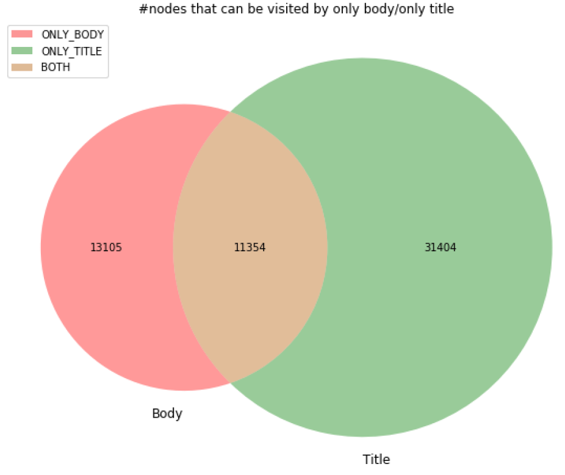
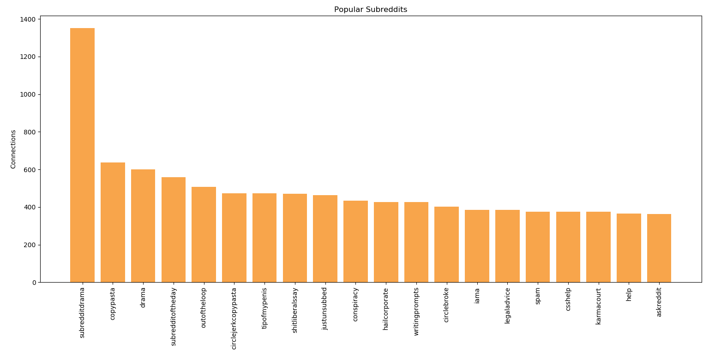

# Graph Data :metal:

We are provided with some temporal graph data and asked to illustrate some exciting insights hidden within it. There is no pre-defined "correct solution", but we demonstrate mastery of graph data modelling in the context of doing Data Science.

## Data :cloud:
Reddit is an American online community of message forums that is split into "sub-reddits" that each have a self-defined focus. We are provided with a hyperlink graph (https://snap.stanford.edu/data/soc-RedditHyperlinks.html), where each node represents one of the 55,000 sub-reddits and an edge indicates that a post in one sub-reddit linked to a post in another sub-reddit. The edges are directed and multivariate: they are labeled with a creation timestamp and a (crowd-sourced) sentiment polarity that indicates whether the linking content was explicitly negative towards the target sub-reddit.

## Packages and Software used :computer:
Python  
matplotlib  
D3.js (Chord diagram)  
Neo4j  
Tableau  

## Insights :pencil:

