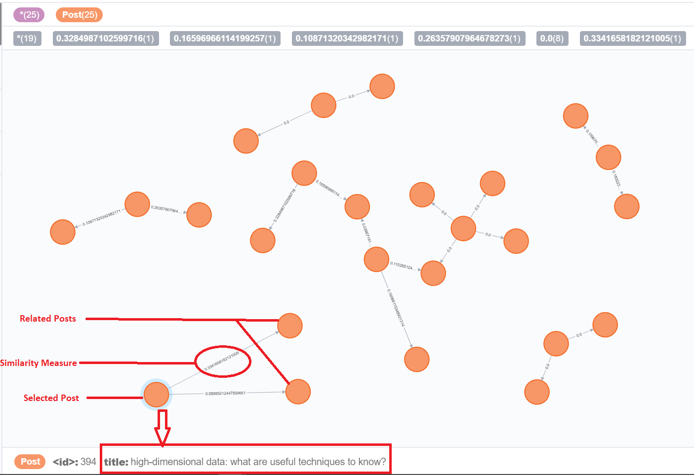
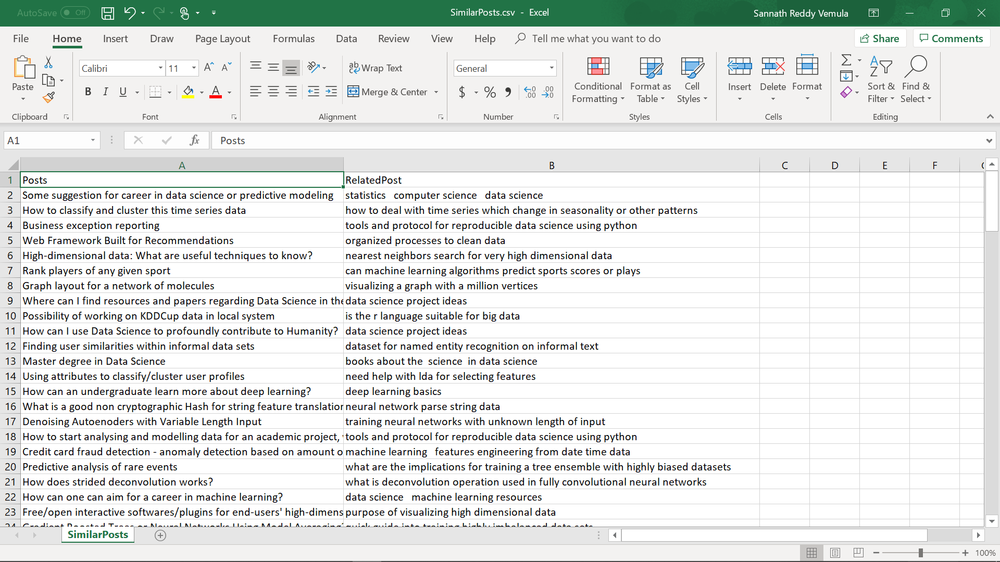
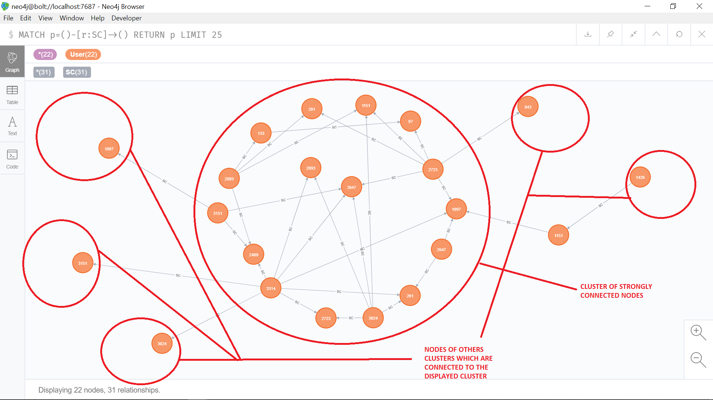

# Heterogeneous Data :metal:

We have a broad understanding and a solid toolkit for four of the most fundamental types of data: relational, spatio-temporal, graph-based, and textual. Unfortunately, these rarely exist in isolation like how we have been studying them. Indeed, the co-presence of multiple data types, and the need to think concurrently in multiple data models, i.e., the existence of heterogeneous data, is what most people face most of the time. It's one of the biggest challenges in Data Science, whether industry or academia.

## Data :cloud:
We are provided with dataset that is an archived data dump of an entire StackExchange community (incidentally, the one on Data Science). StackExchange is a question and answer (Q&A) forum, where users contribute "posts" (i.e., questions and answers) which they upvote. There is a tagging system to organise posts and a badge system to incentivise users.
 
The data dump contains a broad selection of the elements we have been looking at previously: the posts themselves are (marked up) temporal text, with revision histories; the votes resemble our previous MovieLens dataset; there are myriad opportunities to construct graph representations of elements of the data. We are unrestrained! The data itself is described in the following readme: https://ia800107.us.archive.org/27/items/stackexchange/readme.txt.

## Packages and Software used :computer:
Python  
matplotlib  
Neo4j  
Tableau

## Insights :pencil:

