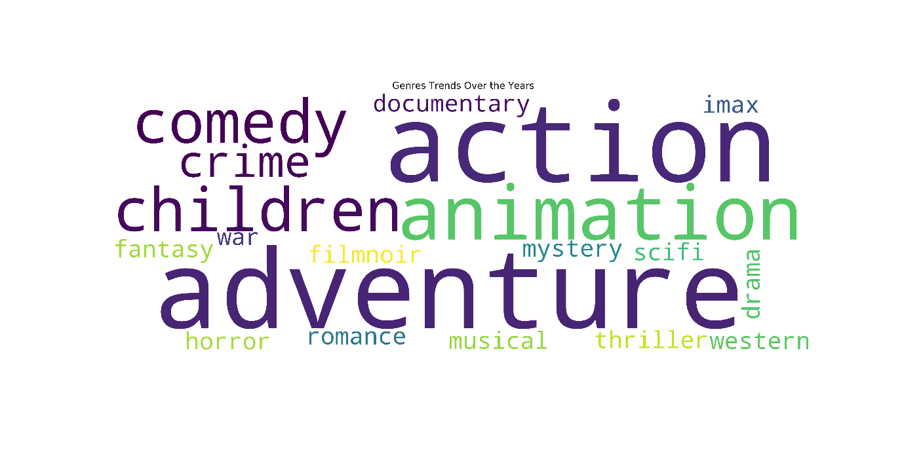

# Relational Data Model :metal:

Let's play Data Science! 
We are provided some relational data and illustrating some exciting insights hidden within it. There is no pre-defined "correct solution", but we demonstrate mastery of the relational data model in the context of doing Data Science.

## Data :cloud:
The MovieLens dataset (https://grouplens.org/datasets/movielens/) is a publicly-released dataset of user movie ratings, built with a relational schema.

## Packages and Software used :computer:
Python
matplotlib
Tableau

## Insights :pencil:

