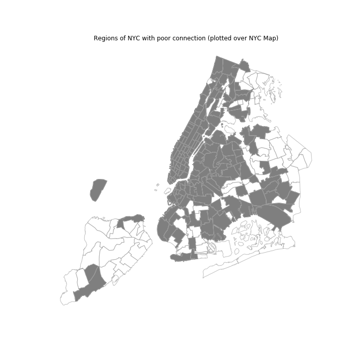
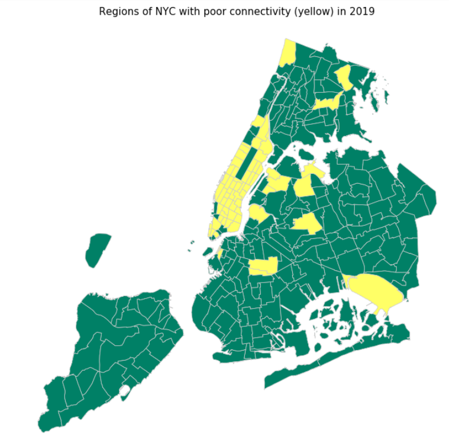
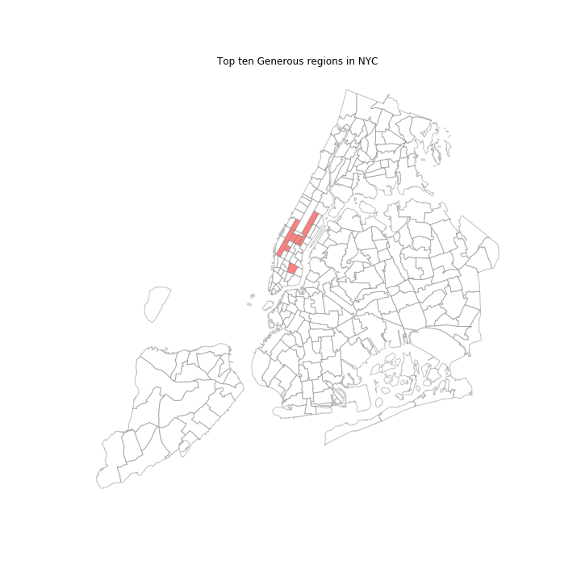
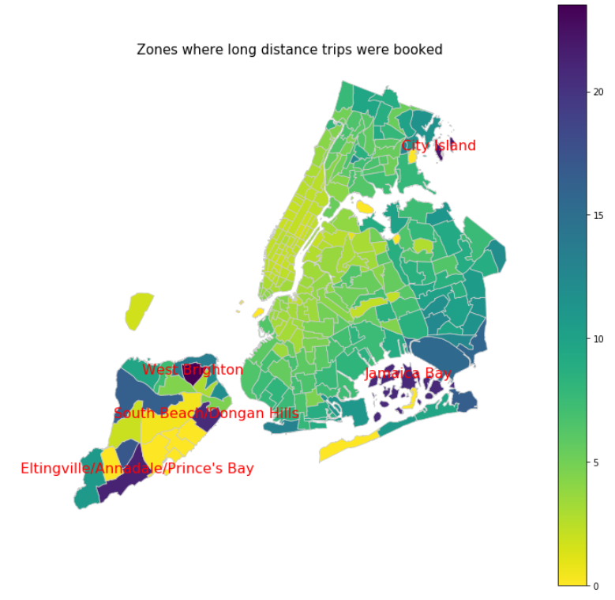
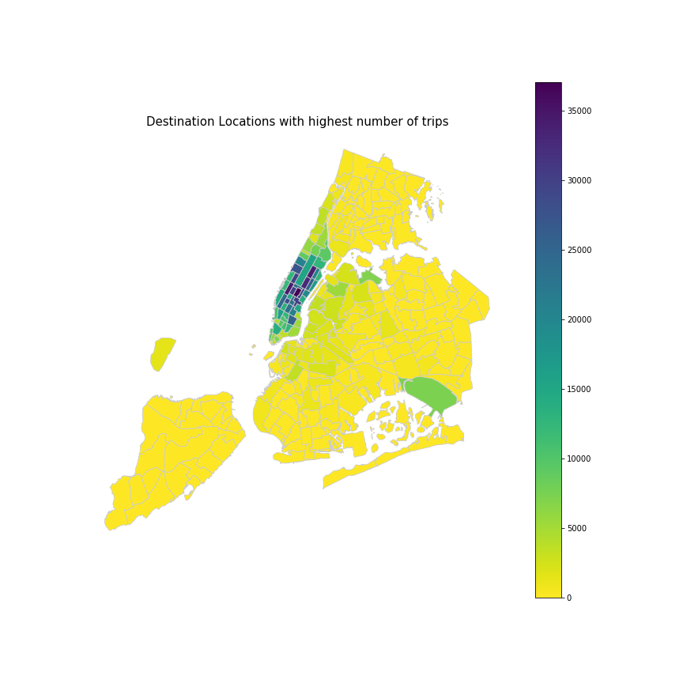
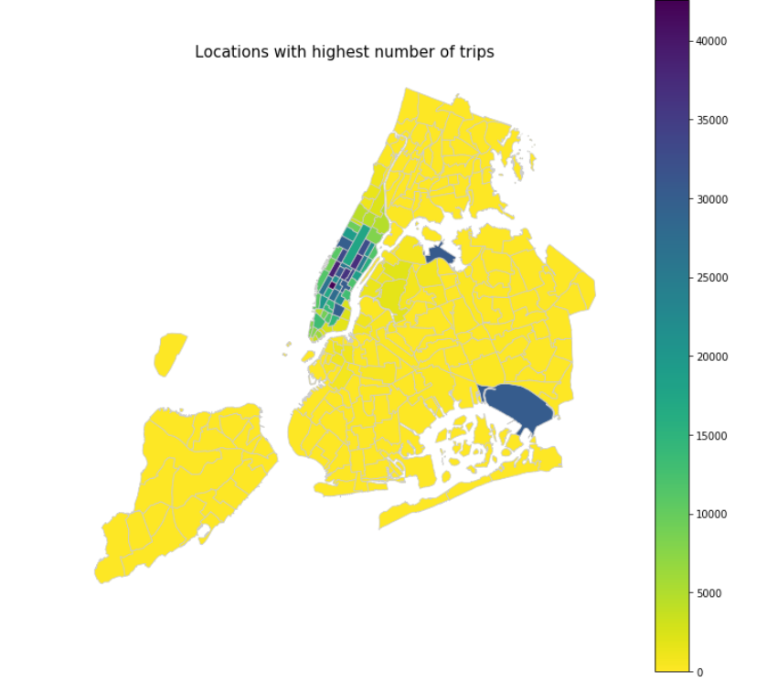

# Spatio-temporal Data :metal:

We are provided with spatio-temporal data and illustrate some exciting insights hidden within it. There is no pre-defined "correct solution", but we demonstrate mastery of spatio-temporal data modelling in the context of doing Data Science.

## Data :cloud:
The New York City Taxi dataset (https://data.cityofnewyork.us/Transportation/2018-Yellow-Taxi-Trip-Data/t29m-gskq) is a publicly-released dataset of taxi trips in New York City, with a strong spatio-temporal aspect. We also need the taxi zone maps, provided at http://www.nyc.gov/html/tlc/html/about/trip_record_data.shtml, in order to interpret the spatial attributes.

## Packages and Software used :computer:
Python  
matplotlib  
Tableau

## Insights :pencil:

