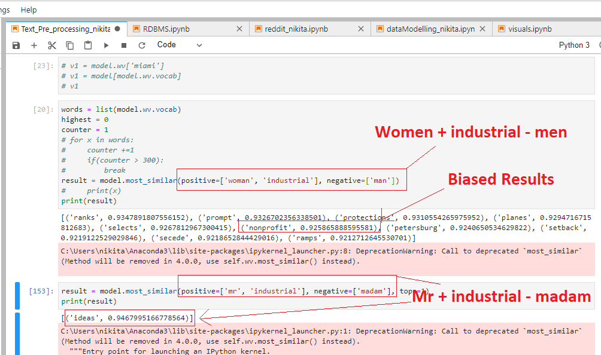
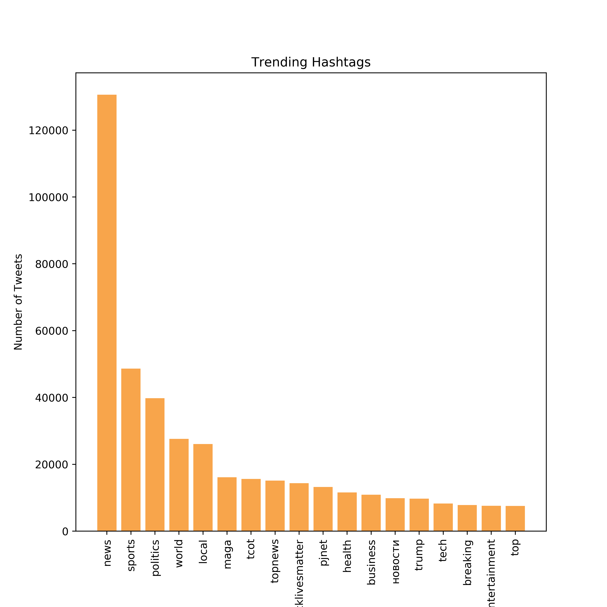
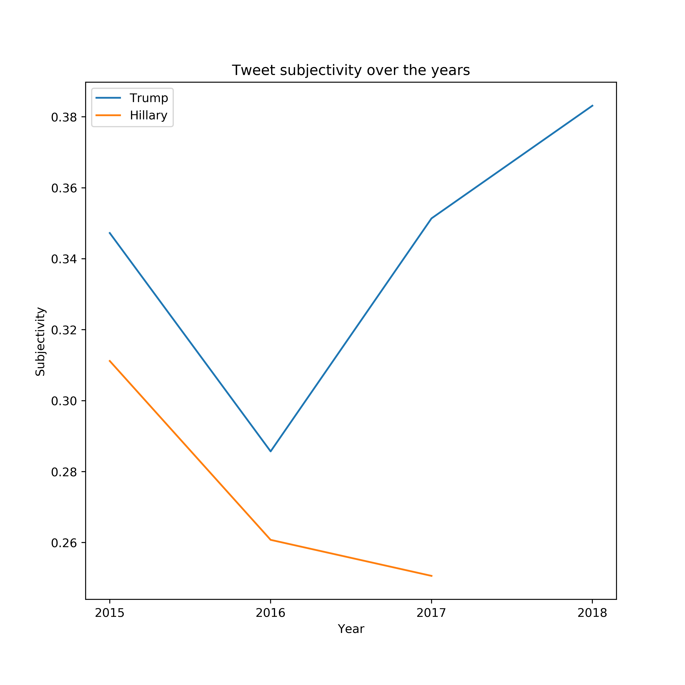

# Text Data :metal:

We are provided with some raw text data and illustrate some exciting insights hidden within it. There is no pre-defined "correct solution", but we will demonstrate mastery of text data modelling in the context of doing Data Science. Additionally, we show gender biasing in the dataset. 

## Data :cloud:
In the lead-up to the 2016 US presidential election, a Russian "troll factory," the Internet Research Agency (IRA), is alleged to have deliberately sought to sow political discontent in the US with inflammatory social media content. Twitter reported to the US congress a list of thousands of Twitter handles associated to the IRA. We are provided with all the tweets produced by these twitter accounts since 2012: https://github.com/fivethirtyeight/russian-troll-tweets. In addition to the raw text content, several dimensions of meta data are provided.

## Packages and Software used :computer:
Python  
matplotlib  
Tableau

## Insights :pencil:

